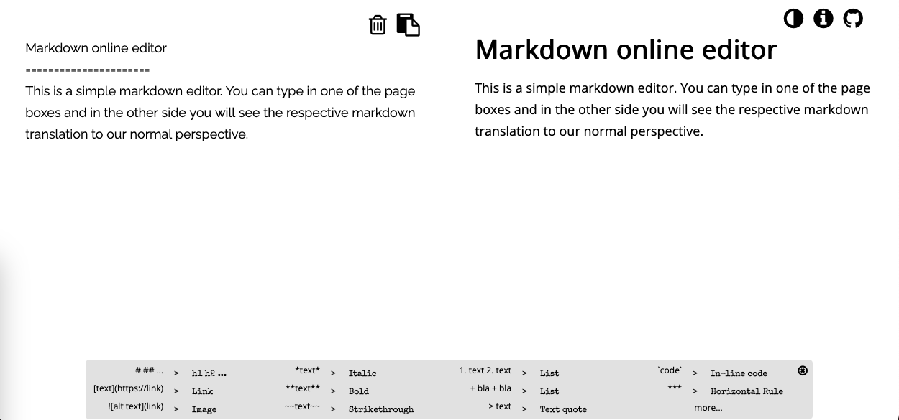

Markdown online editor
======================
This is a simple markdown editor. You can type in one of the page boxes and on the other side you will see the respective markdown translation to our normal perspective.

## Demo

## Contributing
This is a simple project that I built some time ago to learn more about markdown parsers in javascript.
At this point, there is no active development on this project.
But, if you feel like you can add/contribute something, feel free: Create an Issue and we will work together on the PullRequest.

## Acknowledgements 
This project would not be possible without some libraries as:

+ [jmcmanus/pagedown-extra](https://github.com/jmcmanus/pagedown-extra)
+ [FortAwesome/Font-Awesome](https://github.com/FortAwesome/Font-Awesome)
